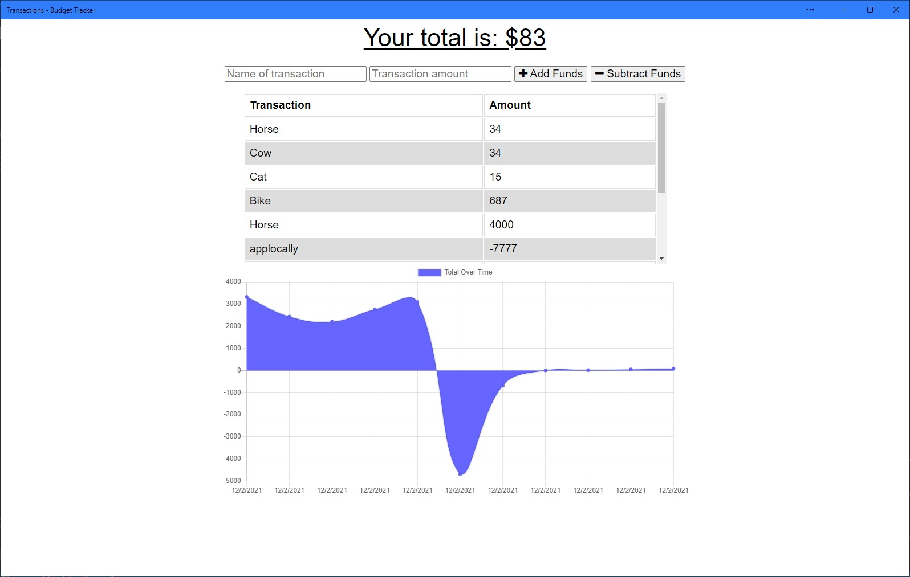

## Budget-Transactions Challenge 19

<p align="center">
    
    
    
    
    

</p>

This application gives the user a fast and easy way to track their money, allowing them to access that information at any time and with or without an internet connection is mportant. 

I added functionality to an existing budget tracker application to allow for offline access and functionality. Those of use my app will be able to add expenses and deposits to their budget with or without a connection. When entering transactions offline, they will update the total when brought back online. My application is deployed on Heroku and using a MONGO backend database. 

## User Story

```md
AS AN avid traveller
I WANT to be able to track my withdrawals and deposits with or without a data/internet connection
SO THAT my account balance is accurate when I am traveling 
```

## Acceptance Criteria

```md
GIVEN a Budget Tracker without an internet connection
WHEN the user inputs an expense or deposit
THEN they will receive a notification that they have added an expense or deposit
WHEN the user reestablishes an internet connection
THEN the deposits or expenses added while they were offline are added to their transaction history and their totals are updated
```

## Mock-Up

The following image shows the web application's appearance and functionality:




## This app hinted that I should revisit previous challenges:

IndexedDB to add offline functionality from Module 18: NoSQL, Lesson 4: 

Add service worker to my application from module 19: Progressive Web Applications (PWA), Lesson 4: 

### Deployment to Heroku Using MongoDB Atlas

My budget tracker app has a server and uses MongoDB as its database, so I needed to deploy my application to Heroku using MongoDB Atlas. 

## Submittial

I am required to submit BOTH of the following for review:

* The URL https://uncc-budget-transactions.herokuapp.com/ deployed application.

* The URL https://github.com/mcswajl/Budget-Tracker GitHub repository. 

## Contact Information
Josh McSwain
Email: joshua.mcswain@mecknc.gov
UNCC Coding Bootcamp Fall 2021
